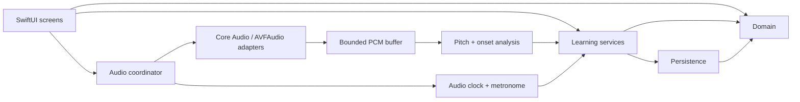

# Архітектурний план

## Стек і структура

SwiftUI — UI; AppKit — лише необхідні macOS-інтеграції. Foundation — моделі й persistence; AVFoundation/AVFAudio + Core Audio — аудіо; Accelerate за потреби — DSP. String Catalogs — UI `en`/`uk`. Framework API звіряти з обраним SDK, особливо відмінності macOS та iOS.

Початково один Xcode app target і локальний Swift package з тестованими модулями. Не створювати мікропакет для кожного екрана. Після scaffold очікується така структура:

```text
PersonalGuitarCoach.xcodeproj/
App/                         # composition root, scenes, navigation, feature UI
Packages/GuitarCoachCore/
  Sources/Domain/             # музична модель, exercise/session contracts
  Sources/Audio/              # hardware adapters, DSP, clock, transport
  Sources/Learning/           # lesson loading, matching, assessment, advice
  Sources/Persistence/        # локальні repositories та migrations
  Tests/                     # domain, DSP, matching, persistence
Resources/
  Localization/              # UI catalogs
  Lessons/                   # manifests, en/uk тексти, event data
Tests/UITests/
Tests/Fixtures/Audio/         # невеликі fixtures + provenance; великі — окремо
docs/
tasks/
```

Це цільова структура, не перелік наявних файлів. Test target memberships і resource bundle paths має зафіксувати задача 01.



## Єдина музична модель

| Сутність | Основні дані та інваріанти |
| --- | --- |
| `Pitch` | MIDI note number, octave, optional spelling; реальна висота звучання, C4 = 60 |
| `TuningProfile` | ID, revision, display name, шість `stringNumber → openMIDINote`, reference A4 |
| `InstrumentProfile` | tuning ID/revision, 24 лади, orientation; extensible, але MVP має 6 струн |
| `FretPosition` | stringNumber 1…6, fret 0…24; muted описується окремо |
| `Fingering` | позиції й optional finger labels для підказки; не результат audio recognition |
| `MusicalEvent` | stable ID, startTick, durationTicks, `note` / `rest`; note містить одну чи кілька позицій |
| `Exercise` | ID/version, ordered events, PPQ, time signature, tempo limits, tuning policy, assessment mode |
| `Lesson` / `LessonStep` | stable ID/version, localized content, exercise refs, event IDs або fingering для підсвічення |
| `AudioConfiguration` | stable device UIDs, channel map, actual sample rate/buffer, route version |
| `DetectedNote` | frequency, nearest MIDI/cents, onset timestamp, confidence, optional end timestamp; без «розпізнаної струни» |
| `PracticeSession` | attempt ID, state, immutable exercise/tuning/config snapshots, analyzed observations |
| `AssessmentResult` | algorithm version, validity, per-event results, metrics, recommendations, calibration snapshot |

Ноти й позиції не мають незалежних суперечливих джерел істини: частоту/висоту цільової події обчислює resolver із позиції та зафіксованого строю. За наявності spelling metadata валідатор перевіряє його узгодженість. Для fixedTuning resolver використовує стрій вправи; для followsInstrument — snapshot вибраного профілю.

Приклади, всі строї в порядку **6 → 1**:

- Standard: E2 A2 D3 G3 B3 E4 → MIDI `[40, 45, 50, 55, 59, 64]`.
- Drop D: D2 A2 D3 G3 B3 E4 → `[38, 45, 50, 55, 59, 64]`.
- D Standard: D2 G2 C3 F3 A3 D4 → `[38, 43, 48, 53, 57, 62]`.

У коді профіль зберігає явні номери струн, а не масив із неочевидним порядком. `MIDI(position) = openMIDI(string) + fret`. `frequency = referenceA4 × 2^((MIDI − 69)/12)`. Для cents використовувати `1200 × log2(observedHz / targetHz)`.

Реалізація Domain: `Pitch` з MIDI 0…127; профіль A4 400…480 Hz; відкриті струни MIDI 0…103, щоб усі 24 лади лишалися валідними MIDI-нотами. Ці технічні межі ширші за перевірений DSP-діапазон; оцінювання окремо перевіряє підтримувані частоти. `TuningProfile.strings` зберігається за явними номерами 1→6. Codable-декодування використовує ті самі валідатори, що й public init. `ResolvedEvent` обчислюється з вправи та строю і не декодується як незалежне джерело висот.

PPQ = 960, четверта = 960 ticks; у MVP підтримуються 3/4 та 4/4, без tempo map, swing і tuplets. Темп однієї спроби сталий. Пауза займає час, але не очікує ноти. Одночасні позиції допустимі для показу акордів, проте monophonic assessment їх відхиляє до запуску.

## Локалізація оболонки

`AppSettings` зберігає System/en/uk і System/light/dark у UserDefaults; `AppNavigation` окремо володіє destination. Мова передається через locale environment, а scene/menu/window titles резолвляться явно з en/uk bundle, без скидання identity views. System використовує першу підтримувану preferred localization, fallback — English. Системні permission dialogs і стандартні меню macOS підкоряються налаштуванням ОС. String Catalog містить plural variations (en one/other; uk one/few/many/other); не збирати речення конкатенацією.

`CoachLayout` задає відступи й мінімальний content size 900×620. Нові екрани підключаються у `AppRootView`, використовуючи спільні preferences, navigation та native toolbar. Тимчасові порожні стани замінюються відповідною функціональністю у наступних задачах.

## Логіка UI

NavigationSplitView для каталогу й detail; окремі Settings та Tuner destinations. Один selection model тримає lessonID/stepID/eventID; гриф і табулатура підписуються на нього. Вибір кроку зіставляється з діапазоном event IDs, без пошуку за текстом. Курсор transport — інший стан, щоб playback не руйнував ручний вибір.

Гриф у звичному табулатурному порядку: струна 1 зверху, 6 знизу, nut ліворуч. Дзеркальний режим змінює напрямок ладів, але не domain numbering і не порядок рядків табулатури. Клавіатурний фокус й VoiceOver описують номер струни, лад, ноту та стан маркера.

Простий еталонний tone playback потрібен для прослуховування послідовності; він не обіцяє реалістичного тембру гітари. Еталон, клік і input capture мають керовані режими та не потрапляють у scoring як одна змішана шина.

## Сервіси та потоки

- `AudioDeviceService`: enumeration, stable UID, input/output capabilities, change listeners.
- `AudioSessionCoordinator`: конфігурація, permission, start/stop, shared capture для tuner/practice, recovery.
- `AudioCaptureBackend`: вибраний у прототипі macOS шлях; AVAudioEngine або AUHAL за узгодженим інтерфейсом.
- `PitchDetector` / `OnsetDetector`: PCM → timestamped evidence, без UI; повністю відтворювані offline tests.
- `Transport`: спільна часова шкала відліку, метронома, preview і очікуваних подій.
- `PracticeEvaluator`: одноразове зіставлення атак та оцінки з версіонованими параметрами.
- `RecommendationEngine`: правила → localized keys + параметри + посилання на фрагмент.

Аудіобекенд не фіксується до задачі 02: окремі input/output devices і їхні clocks потребують перевірки. Core Audio hardware enumeration не означає автоматичної підтримки всіх маршрутів. Не використовувати iOS AVAudioSession як основу macOS routing.

## Збереження

MVP: Codable JSON repositories із versioned envelopes й атомарною заміною файлу в Application Support; прості preferences через UserDefaults. Контент уроків read-only у bundle. Repository protocols дозволяють пізніше перейти на базу даних без зміни domain/UI.

Історія складається з окремих session files і відновлюваного індексу. Пошкоджений запис не стирає всю історію; UI пояснює проблему. Session snapshot містить розв'язані цільові pitches/позиції, locale-neutral recommendation IDs, версії й calibration metadata. Перейменування профілю або оновлення уроку не змінює минулі результати.

Довгостроково зберігати підсумки та per-event evidence, а не безмежний потік PCM/analysis frames. Development fixtures мають походження й умови використання. Службова діагностика не зберігає приватний звук.

## Реалізований контракт сховища

`LocalRepository` — спільний actor для native scenes. Foundation визначає sandbox-aware Application Support/PersonalGuitarCoach. `instrument.json` має envelope v2; підтримується явна міграція v1 (source раніше не задано → electricInterface). Читання не переписує оригінал. Відновлення defaults зберігає копію в Recovery перед атомарною заміною.

`Sessions/<UUID>.json` — незмінні `PracticeRecord` в envelope v1. Повний Exercise/InstrumentProfile/BPM/range та CalibrationSnapshot зберігають контекст; AssessmentSnapshot має власний envelope v1 та algorithmVersion. Це storage DTO: repository обов’язково викликає `validate()` після Codable decode й до видачі UI. Музичні вкладені типи мають власні validating decoders. Схему результату розширювати з явною сумісністю, не переоцінюючи старі записи.

`history-index.json` — відновлюваний cache v1; читання сканує індивідуальні файли. Пошкоджені/новіші файли залишаються на диску й породжують StorageIssue. Index failure після commit — warning; помилка запису самої спроби — throw. Clear history видаляє лише attempt files із Sessions та перебудовує індекс; інструмент і Recovery збережено. Несподівані директорії не видаляються рекурсивно.

`LocalDataStore` оновлює UI preferences тільки після commit, блокує редагування до load/recovery, відображає disk/recovery warnings. UserDefaults зберігає мову/тему окремо. Raw audio не входить у жодну storage модель.

## Профілі строю

Пресети є незмінними. Редагування починається зі створення custom copy з новим stable ID; повторне редагування custom зберігає ID та підвищує revision лише при зміні даних. Preferences перевіряє відповідність selected snapshot елементу registry. Stale expectedRevision відхиляється, а новий snapshot публікується лише після успішного запису.

`LocalDataStore.instrumentWillChange` — synchronous MainActor boundary до публікації нового InstrumentProfile; composition root задачі 16 підключає сюди переривання практики. `TuningRequirementView` показує fixed-tuning mismatch для lesson/practice preflight. `validatePracticeSnapshot` перевіряє структурну сумісність збереженої спроби; `validateForPractice` додатково перевіряє початковий C2–E6 target. Поточні обмеження DSP не повинні змінювати читабельність історії.

UI використовує note names з octave, підтримує ASCII/Unicode accidentals. A4 — частина revision профілю; поле приймає крапку або кому як decimal separator. Зміна профілю не виконує pitch shifting. Computed localization keys спочатку формуються як String, щоб LocalizedStringKey не перетворював ID на форматний аргумент.

## Контент і візуальні цілі

`Learning` містить LessonManifest/Step/Text, read-only LessonCatalogLoader та LoadedLesson. Тільки валідатор створює LoadedLesson для UI. Catalog order і global exercise IDs задаються manifest; en/uk мають однакові lesson/step IDs і version. Пошкоджений урок породжує ContentIssue, але не приховує інші валідні уроки.

`LoadedLesson.visual(stepID:instrument:)` повертає events, display tuning, позиції/висоти/підказані пальці та muted strings. Event set може мати кілька ладів на одній струні для гами; fingering лишається одночасною формою. Text-only/rest кроки не залишають stale note markers. Жодного пошуку нот у prose. Див. CONTENT-AUTHORING.md для JSON-контракту.

LessonLibraryStore завантажує app-bundle ресурси на worker. Reader використовує `LessonSelection` для двобічного вибору кроків і подій табулатури. CLI ValidateLessonContent перевіряє actual bundled content у CI, без audio services.

## Верифікація

Чисті domain/scoring tests працюють без пристроїв; DSP tests проганяють синтетичні та реальні annotated fixtures; UI tests користуються deterministic adapters. Окремий hardware checklist перевіряє USB capture, канал, hot-plug, formats, калібрування й тривалу практику. Автоматизований fake input не закриває hardware gate.

## Реалізований гриф

`FretboardModel` проєктує Domain-позиції через `TuningProfile.pitch(at:)`; не має власної формули нот. `FretboardView` отримує expected positions/mutes/fingers, binding ручного вибору та optional detected pitch. Canvas малює тільки струни/лади; 150 native buttons задають незалежні hit targets і accessibility. Дзеркальність змінює горизонтальний порядок 0…24, а не номери струн або pitches. Клавіатурні стрілки рухають focus за екранним напрямком; Space/Return змінюють selection. Зовнішня зміна expected набору прокручує до його першого ладу. Detected pitch лишається окремим позначенням без атрибуції до струни.

## Реалізована табулатура

`TimelineModel` тримає canonical Exercise/ResolvedEvent, а геометрію обчислює відносно початку такту. Integer subtraction перед Double conversion зберігає точність великих абсолютних ticks. `TimelineSegment` обрізає лише графічне представлення довгої події на межі такту, зберігаючи event ID і позначку continuation. `TimelineSelection` тримає стабільний anchor для вибору діапазону.

`TablatureView` будує не більше 16 тактів за раз через LazyHStack; попередня/наступна частина та перехід за номером зберігають доступ до всіх тактів. Мінімальний масштаб дає шістнадцятій 44 точки, масштабування 1×–2× не змінює час. Струна 1 завжди зверху; орієнтація грифа не перевертає часову послідовність.

Курсор — вхідний optional tick, без timer. `TimelineFollowTarget` адресує половину долі для прокручування всередині збільшеного такту; фокус/сторінка не стають джерелом часу. Клавіатурна навігація спочатку монтує потрібну частину, потім фокусує event button. Debug-only fixtures і точний minimum-window helper доступні через Developer menu; Release не містить цих flows.

## Читання уроків і перехід до практики

`LessonSelection` зберігає step/exercise IDs та ручний range anchor. Event IDs локальні до вправи; для події в кількох кроках лишається поточний відповідний крок, інакше перший за manifest order. Явний вибір кроку скидає ручний range і вибір позиції. Немає циклу observers між незалежними view selections. UI copy перемикається без зміни selection identity.

`reading-progress.json` — envelope v1: last lesson ID, per-lesson version/step bookmark та окремий readVersion. Зміна версії уроку повертає читання до першого кроку, але не позначає нову версію прочитаною. Missing file дає defaults; corrupt/future file зберігається й блокує перезапис із локалізованим повідомленням, не блокуючи уроки. `ReadingProgressStore` серіалізує/coalesces pending snapshots і має явний retry після write failure. Він використовує той самий LocalRepository actor, що preferences/history. Clear practice history не зачіпає читання.

`PracticeRequest` містить lesson ID/version і повний Exercise snapshot із practiceExerciseIDs. Display-only не може створити цей request. Поточний preflight показує policy/стрій/темп та повернення до уроку; transport/session додаються задачами 14–16. Debug UI tests можуть вибрати ізольований тимчасовий repository через UUID `COACH_UI_TEST_STORAGE`; Release ігнорує цей test hook.
