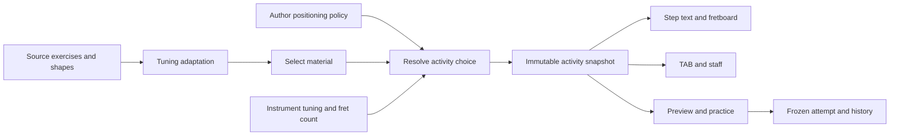

# Author-controlled lesson positioning

Status: **implemented design**, 2026-09-12; final delivery evidence is tracked in [LD01–LD04](../../../tasks/follow-up/lesson-design-system.md). Illustrative fragments accompany the complete runnable demonstration in Resources/Lessons/same-notes-new-position. The sole current API is documented in [content authoring](../../CONTENT-AUTHORING.md).

## Problem and decision

The preceding implementation was reusable across interval lessons, but permission was inferred from `adaptation.policy == transposeIntervals`. One optional `LessonPosition` affects the whole lesson, uses a hard-coded five-fret region, and is saved once per lesson. The author cannot disable it, constrain particular teaching examples, or show the same musical material in two independent positions within one lesson. `practiceExerciseIDs` also cannot distinguish two teaching activities using the same exercise.

Make positioning an explicit part of lesson design. Separate **musical material**, **positioning permission** and **activity**. A step explains or demonstrates an activity; a practice entry starts its resolved exercise. Activities reuse source notes without duplicating them. This is a declarative extension of the YAML lesson system, not a scripting language, visual editor or generated-course service.

Tuning adaptation and positioning are separate operations. The former determines the sounding notes for the selected tuning; the latter changes where those same notes are played. Positioning preserves exact MIDI, including octave, durations, ordering and rests. Changing key or substituting octaves would need a separately named future feature. The author may explicitly enable positioning even for a material whose tuning adaptation preserves physical positions; permission must no longer be inferred from the lesson's topic or tuning policy. Existing physical-technique lessons opt out.

## Author model

Lesson manifest **schemaVersion 2** adds these entities while retaining canonical `Exercise`/event data and the existing tuning-adaptation contract:

| Entity | Purpose |
| --- | --- |
| `materials[]` | Named references to source musical data, with optional positioning permission. No duplicate MIDI target list. |
| `activities[]` | Instances of a material: free exploration, an original demonstration, or a fixed-position task. Each has independent selection state. |
| `steps[].activityID` | Connects localized teaching and the selected visual subset to an activity. Several steps can share one activity. |
| `practiceEntries[]` | Stable entry ID, activity ID and source exercise ID. Replaces `practiceExerciseIDs` in schema 2 so one exercise can be practiced in multiple contexts. |
| `fingerings[]` | Named source shapes (`id`, `exerciseID`, `fingering`), extracted from inline shape steps when migrating. Shape materials reference these values, not other activities. |

A material's `source` is exactly one of:

| `kind` | Required fields | Meaning |
| --- | --- | --- |
| `lesson` | none | All authored exercises and source fingerings, excluding activities; no recursive resolution. |
| `exercise` | `exerciseID` | The entire exercise. |
| `events` | `exerciseID`, `eventIDs` | A nonempty contiguous sequence in exercise order, including internal rests. One monophonic event represents one note. |
| `fingering` | `fingeringID` | The entire simultaneous shape; display/preview only under current assessment capability. |

Positioning a chord means moving the complete voicing with distinct strings and the existing chord-span constraint. Selecting one voice of a chord is outside the first version. A shape and its linked arpeggio must be resolved consistently; resolving a whole-lesson material retains that shared mapping. A material must not combine different incompatible fixed tuning contexts in one activity; report this to the author rather than picking one implicitly.

There is no precedence tree of lesson/exercise/event overrides. Each activity names exactly one material with one policy. Overlapping materials are permitted because their activities have separate snapshots. A single activity cannot silently merge conflicting transformations. For a whole lesson, author one `lesson` material and let all relevant steps refer to its shared activity.

## Explicit positioning policy

Omitted `positioning` or `{ "enabled": false }` means positioning is unavailable for a **new schema-2 material**. An enabled policy is fully specified:

```json
{
  "enabled": true,
  "preserve": "soundingPitch",
  "windowFrets": 5,
  "allowedStarts": { "kind": "explicit", "frets": [3, 7] },
  "allowOriginal": true
}
```

`windowFrets` counts consecutive fret numbers, including 0 if applicable. Proposed supported range is 1–6; 5 keeps current behavior. A region from 7 with width 5 permits frets 7…11, not just fret 7. The first note may be above its start. An author can use width 6 for a scale needing frets 7…12; this does not relax the separate chord-span rule or guarantee comfortable fingering. The upper bound is clipped by the instrument's selected fret count, never by changing pitches.

`allowedStarts` is one tagged value:

- `auto`: consider starts 0…instrument maximum fret.
- `explicit`: unique ascending `frets`, each 0…24; at least one.
- `range`: inclusive `minimum` and `maximum`, with `step` default 1; positive step, ordered bounds 0…24. Generate minimum + k × step ≤ maximum.

These are **allowed region starts**, not a list of all fret numbers on which notes may occur. Actual choices are their intersection with regions where **the entire material** can be resolved on the selected tuning and neck. Selecting one step or practice fragment does not loosen a broader material's permission. `allowOriginal` is an additional explicit option, independent of the region list. Original uses the existing tuning/fret-count resolver; it can also be unavailable.

An activity's `positionSelection` is either:

```json
{ "mode": "learner", "default": { "kind": "original" } }
```

or:

```json
{ "mode": "fixed", "value": { "kind": "region", "firstFret": 7 } }
```

For enabled policies, this field is required. For disabled policies it is omitted and uses Original without a picker. Fixed selections must be permitted by the material. Learner defaults must be author-permitted but may be physically unavailable on a particular instrument. No invisible fallback: show the unavailable selection and offer feasible alternatives. A fixed activity has a position label, not an editable picker. A learner activity shows the picker near the material it controls. One shared activity can still provide the existing whole-lesson picker.

## Positions as part of teaching

[The example](authoring-example.json) reuses the current major-scale exercise in four activities:

1. Inspect the tonic in another location: one event, separate choice from the scale.
2. Explore the complete scale: choose Original, a region near fret 3 or near fret 7.
3. Play the scale in the original fingering: fixed activity and practice entry.
4. Play the same scale near fret 7: another fixed activity and practice entry.

The existing ordered step list provides the sequence. Reading the fourth step resolves its activity; it does not overwrite the second activity's saved choice. Returning to exploration restores that choice. Repeated use of the same activity ID deliberately shares state. Preview and practice are launched explicitly, never by merely selecting a step. Moving to another activity stops its previous preview; replacing a practice request closes an active attempt with its old evidence intact.

This supports a lesson about finding the same note on several strings, a scale in several positions, and guided successive performances without duplicating source notes. First implementation: each performance has a fixed resolved position and a separate attempt/count-in. A continuous exercise that changes position mid-performance needs a later explicit per-event position plan and transition constraints; do not pretend separate attempts measure the timing of that transition. Nothing in this proposal automatically composes such a performance.

Completion distinguishes reading, manual self-confirmation and linked audio attempts. A valid audio attempt can establish pitch/timing performance, **not use of the requested string/fret or hand position**. The first version needs no automatic lesson-completion gate based on fingering. Guided steps may ask the learner to confirm trying the shape, with that fact stored separately from audio results. A required unavailable activity remains incomplete; unrelated reading/activities remain accessible.

## Resolution and shared presentation



Learning owns a pure activity resolver. Snapshot identity includes lesson/version, material/activity IDs, source exercise versions, tuning/fret count, choice, policy snapshot and resolver version. Resolve deterministically; do not perform musical calculations in views. Cache availability by source content/version, policy and relevant instrument values; cap work using existing event/shape limits and enumerate region starts rather than a Cartesian product of choices.

For a note/fragment material, build a temporary resolved Exercise for preview/practice from the same selected events: subtract the first event's tick, preserve durations and internal rests, retain provenance `(sourceExerciseID, sourceEventID)`. Treat the end as a partial final bar under the existing practice contract; do not fabricate notes or absorb surrounding source events to satisfy whole-bar selection. A fragment containing no sounding monophonic note cannot be a practice entry. Snapshot the derived exercise and its source tick offset so results/recommendations map back correctly. Whole-exercise entries keep existing event ticks.

A source fingering cannot become graded chord practice just because it has a position policy. Existing signal, calibration, tempo and frequency capability gates still apply after musical resolution. A technically feasible fingering and an assessable audio exercise are separate availability decisions.

Instrument changes recompute the active activity and options. If its saved/fixed choice becomes impossible, retain it with a reason such as `regionUnplayable`, `beyondFretCount` or `incompatibleTuning`; do not silently switch key, octave, position or activity. Original and other allowed regions can recover a learner activity. Fixed activities explain the requirement; authors can choose a wider window or write another explicit activity for different teaching intent.

## Text, progress and history

Both languages add an `activities` text map with exactly the same IDs, each with a localized title/body. Generic lesson theory remains independent of the instrument. Activity and step templates render notes, positions and region labels from their own snapshot. Activity templates use `{{positions}}`/`{{notes}}` for the complete material, while step templates restrict them to the selected subset. Add documented context tokens such as `{{positionLabel}}`; do not concatenate translated sentences or infer instructions from prose. In a multi-activity lesson the example card must use the active context rather than the first practice exercise. Fixed “near 7” instructions must match the manifest selection. Keyboard focus and VoiceOver identify the material, current position and availability reason.

Save learner choices by `(lessonID, publishedLessonVersion, activityID)`, with separate current step/activity. Fixed activities derive choices from authored data and must not overwrite learner bookmarks. A changed policy can invalidate a saved choice: retain an explicit invalid state until the learner selects again. An incompatible lesson version follows the existing version-aware restore rule; no guess from translated titles.

New attempts freeze activity/material/practice-entry IDs, normalized choice, full positioning policy (including window width), resolver version, instrument, derived Exercise and source mapping. A first-fret integer alone is insufficient if the author later changes width or allowed positions. Retries use this snapshot even after policy/content changes. Comparison requires compatible frozen context and existing exercise/tuning/tempo/range/algorithm conditions. Progress through two fixed activities is different from comparing scores under identical conditions.

## Loader, migration and authoring workflow

**User amendment:** the new lesson API is the only supported API. Do not retain a schema-1 lesson decoder, implicit whole-lesson positioning, `adapted(to:)` compatibility facade or baseline/adaptive text editions. Schema 2 is mandatory for lesson manifests; catalog ordering may retain its separate schema 1. Existing source lessons and templates are migrated together with their consumers. Each lesson has one published version, exercises have their own versions, tuning adaptation declares only its policy, and en.yml/uk.yml contain the current generic theory plus activity/step templates. Unknown/old lesson schemas fail before payload interpretation.

Material permissions default off. Explicitly migrate current interval lessons to whole-lesson auto/width-5 learner activities and physical lessons to disabled policies. Existing saved practice evidence is a separate persistence contract: preserve complete exercises, tuning, timestamps and scores without regrading. Supporting those records does not require a legacy lesson API. New attempts freeze their activity context and localized display identity. Bookmark restoration follows the published lesson version and per-activity IDs; no guessed context from translated names.

Because removing the old API requires the model, reader, practice and resources to move together, deliver LD01–LD04 as one coordinated feature change with separately reviewed implementation stages. Do not merge an intermediate app that cannot read its bundled content. This supersedes the earlier suggestion of independently merged compatibility stages. Extend the scaffold and author report against the sole schema-2 loader. New draft positioning remains opt-in.

Validation must cover:

- Tagged-union fields, IDs/references, scope, contiguous event order, duplicate IDs, unknown schemas and unknown positioning tokens.
- Fixed/default choices permitted by policy, width/bounds, nonempty author option sets, shape atomicity and practice capability.
- Actual availability on all eight presets and five neck sizes; authored permission does not imply physical feasibility. A restricted fixed activity may legitimately be unavailable on some instruments; the author report lists these cases separately from malformed content.
- One-note, fragment, whole-scale, shape and whole-lesson resolution; partial rest-only selection, linked shape/arpeggio mapping, unchanged MIDI/ticks and exact source provenance.
- Independent overlapping activities and shared activity state; original → exploration → fixed position → return; preview interruption, invalid saved choice and fresh practice handoff.
- Frozen activity snapshots, saved-attempt decoding, version-aware bookmarks, post-edit retry and comparison isolation.
- en/uk context text, keyboard/VoiceOver, themes and native layout; real audio accuracy remains separately evidenced.

An author-facing validation report should list each activity's allowed/feasible starts per tuning/fret count and why a fixed/default choice fails. This makes it possible to review the pedagogy before launching the app. The report must call the result pitch/geometry feasibility, not proof of ergonomic comfort.

## Delivery plan and acceptance example

The [implementation backlog](../../../tasks/follow-up/lesson-design-system.md) splits schema/resolution, activity UI, practice/history and author tooling into independently verifiable changes. The schema, runtime, consumers and bundled examples are implemented together under the user amendment above. Final verification evidence is tracked in the delivery task.

Acceptance example: with C Standard and 19 frets, explore the major scale from 7 (A♭2 at string 6/fret 8; notes occupy 7–10). Then select the Original guided step, then the fixed-7 guided step, then return to exploration. Key/pitches remain A♭ major, each view matches its activity, the exploration choice is restored, and attempts identify the correct activity. With corresponding Drop B♭, width 5 makes the complete scale from 7 unavailable; width 6 makes it pitch-feasible using frets through 12. These are deliberate author-controlled alternatives, not automatic octave changes.


## Design verification

Checked the two example JSON documents for valid syntax, unique IDs, references to real source exercise/event IDs, contiguous fragments, permitted fixed/default choices, matching en/uk activity IDs and placeholder parity. The design examples are deliberately incomplete manifest fragments. The complete runnable demonstration is now in Resources/Lessons/same-notes-new-position; runtime availability evidence is in runtime-availability.json.

An independent note-location calculation read the actual `c-major-practice` reference positions and evaluated `targetMIDI = referenceOpenMIDI + sourceFret + selectedString1MIDI − 64`. Candidates satisfy `candidateFret = targetMIDI − selectedOpenMIDI` and the authored region/neck bounds. All 160 cases (8 tunings × 5 neck counts × 2 widths × 2 starts) were checked; [compact results](example-checks.json) confirm the width-5/width-6 Drop distinction described above. This establishes monophonic pitch feasibility for these examples, not a new resolver, chord voicing, native UX or pedagogical validation.
